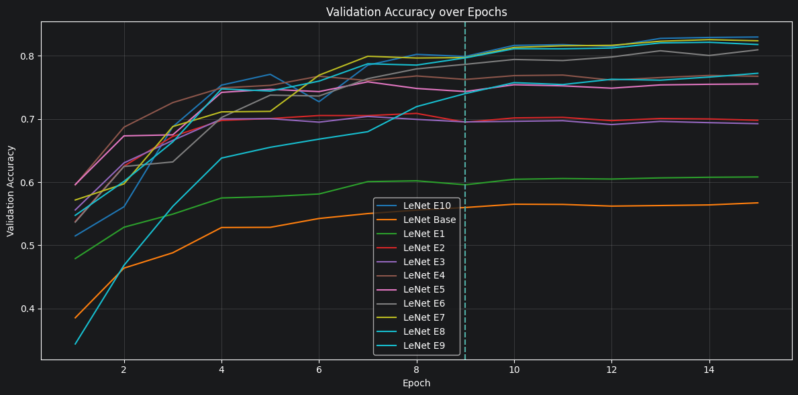
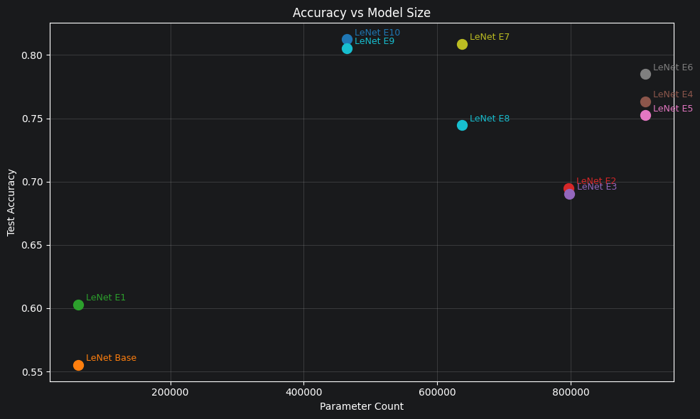

# Progressive CNN Architecture Study: LeNet to VGG-Style on CIFAR-10

A controlled ablation study evolving the LeNet-5 architecture towards modern design principles. Each experiment makes a single architectural change which allows for direct measurement of its contribution to accuracy and parameter count.


## Results



| Model      | Key Change                               | Test Accuracy | Parameters | Epochs to Converge |
|------------|------------------------------------------|---------------|------------|--------------------|
| LeNet Base | Vanilla LeNet-5 (tanh, 5×5 kernels)      | 0.5551        | 62,006     | 9                  |
| E1         | tanh → ReLU + He initialization          | 0.6029        | 62,006     | 9                  |
| E2         | Single 5×5 convs → Stacked 3×3 convs     | 0.6949        | 796,872    | 9                  |
| E3         | + BatchNormalization after each block    | 0.6904        | 797,440    | 9                  |
| E4         | Increased filter counts (32 / 64 / 120)  | 0.7633        | 911,446    | 9                  |
| E5         | AveragePooling → MaxPooling              | 0.7523        | 911,446    | 9                  |
| E6         | + Dropout (0.2) after pooling blocks     | 0.7847        | 911,446    | 9                  |
| E7         | + Additional Convolution block           | 0.8087        | 636,550    | 9                  |
| E8         | + Dropout before dense layer             | 0.7445        | 636,550    | 9                  |
| E9         | Flatten + Dense → GlobalAveragePooling   | 0.8054        | 464,874    | 9                  |
| E10        | Output Dense Layer -> 10 Filter Convolve | 0.8124        | 464,874    | 9                  |




## Key Findings

- **Data leakage:** A validation set leak inflated apparent accuracy from 84% to 53% after correction, demonstrating how subtle leakage can completely invalidate reported metrics.
- **Activation functions:** Naive tanh -> ReLU swap caused dying neurons on Apple M1 Metal backend (float16 precision). Fixed via He initialization and float32 enforcement.
- **Kernel size:** Replacing single 5x5 convolutions with stacked 3x3 convolutions improved model capacity and accuracy at the cost of much higher parameter counts.
- **GlobalAveragePooling:** Replacing the Dense classification head with GAP reduced parameter count by ~1.4x while improving accuracy.
- **Architecture vs. parameter count:** The final model achieves 86% accuracy at 464k parameters, outperforming an intermediate model with 911k parameters which demonstrates that architectural decisions matter more than raw capacity.


## Experimental Setup

|                  |                                       |
|------------------|---------------------------------------|
| Dataset          | CIFAR-10 (50,000 train / 10,000 test) |
| Validation split | 10,000 held out from training set     |
| Optimizer        | Adam (lr=1e-4)                        |
| Batch size       | 64                                    |
| Early stopping   | patience=5, monitor=val_loss          |
| Hardware         | Google Colab T4 GPU                   |

All models trained with identical hyperparameters. Test accuracy reported from a single evaluation on the held-out test set after all training is complete.


## Architecture Progression

### LeNet Base
The original LeNet-5 architecture, implemented faithfully with tanh activations, 5×5 kernels, and AveragePooling. Establishes the baseline on CIFAR-10.
### E1 - Activation Function
Replaces tanh with ReLU throughout. Reveals hardware-specific precision issues on Apple Metal (float16).
### E2 - Kernel Size
Replaces each 5x5 convolution with two stacked 3x3 convolutions. Equivalent receptive field with an additional nonlinearity per block, at the cost of significantly more parameters (62k → 797k). Justified by a 9% accuracy gain.
### E3 - Batch Normalization
Adds BatchNorm after each convolutional block (Conv -> BN -> ReLU). Stabilizes training but produces a slight regression here (69.49% -> 69.04%), suggesting BN alone without additional capacity doesn't help.
### E4 - Filter Counts
Scales filter counts from 6/16/120 to 32/64/120, matching the capacity expected for a colour image dataset. Largest single accuracy jump after E2 (+7%).
### E5 - Pooling Strategy
Replaces AveragePooling with MaxPooling. Causes a slight regression (76.33% → 75.23%) in isolation. MaxPooling's benefit only manifests after Dropout reduces overfitting in E6.
### E6 - Regularization
Adds Dropout(0.2) after each pooling layer as the model was continually hitting ~1 training accuracy. Recovers the E5 regression and exceeds E4, confirming MaxPooling + Dropout interact positively.
### E7 - Additional Convolutional Block
Adds a third convolutional block. Counter-intuitively reduces parameters from 911k to 637k as the restructured filter counts shrink the classification head more than the new block adds. Best accuracy so far at 80.87%.
### E8 - Dense Dropout
Adds Dropout before the dense classification layer. Causes a regression (80.87% → 74.45%), the dense head was not the overfitting bottleneck. Illustrates that Dropout placement matters.
### E9 - GlobalAveragePooling
Replaces Flatten + Dense with GAP, reducing parameters from 637k to 465k. Recovers E7's accuracy without the dense head, confirming the dense layers added parameters without useful capacity.
### E10 - Output Layer
Replaces the final Dense(10) with a 1x1 Conv2D(10). Marginal accuracy improvement (80.54% → 81.24%) with identical parameter count.

## Reproducing Results

```bash
git clone https://github.com/hamdannawaz582/LeNet
pip install -r requirements.txt
jupyter notebook experimentation.ipynb
```

Full training logs and plots are available in the notebook.

